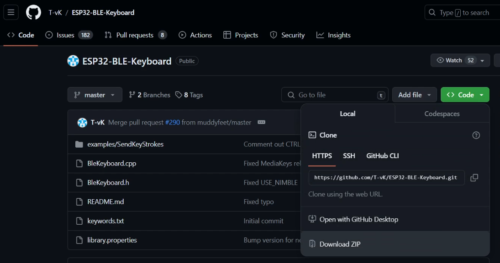
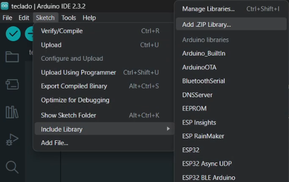
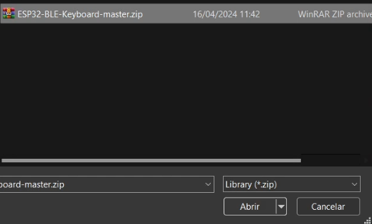
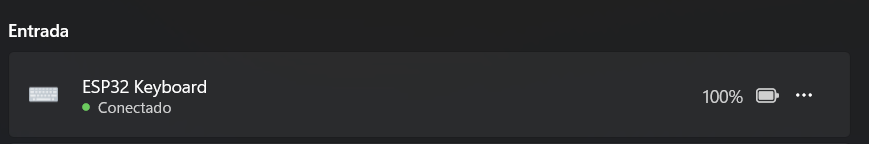
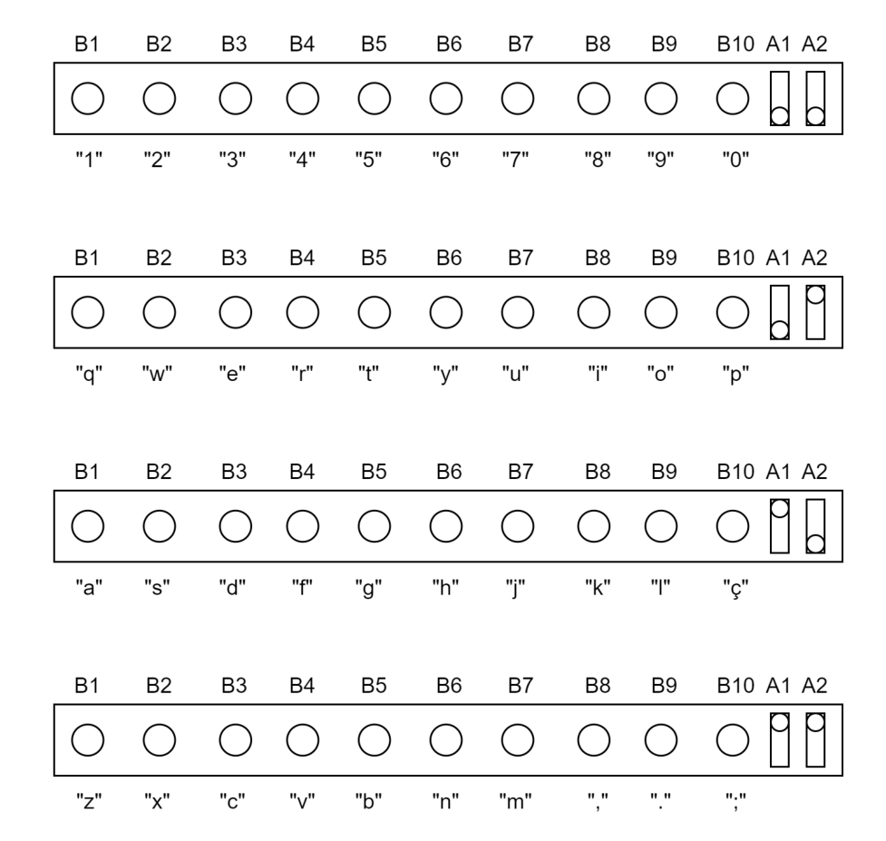
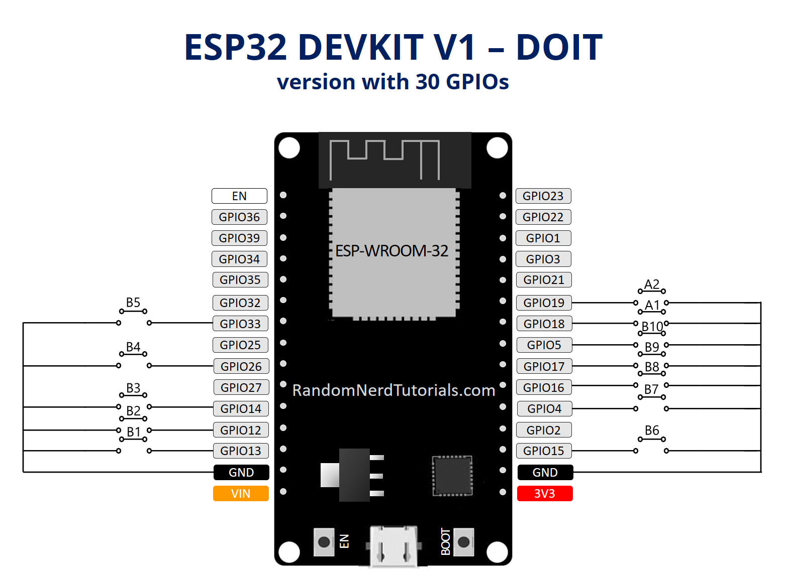

# Teclado Bluetooth

Teclado bluetooth baseado em ESP32 com 10 botões configuráveis (B1, B2, ..., B10) através de 2 alavancas (A1 e A2).

## Programação:
Para programar este teclado na Arduino IDE é preciso instalar a biblioteca [ESP32-BLE-Keyboard](https://github.com/T-vK/ESP32-BLE-Keyboard). 

Para fazer isso, basta baixar seus arquivos como .zip:

\
E incluir a biblioteca como .ZIP no Arduino:

\
, selecionando os arquivos que foram baixados:

## Manual do usuário

O manual do usuário pode ser encontrado neste repositório como `manual_usuario.pdf`.

## Esquema elétrico

Esquema de conexões elétricas:

